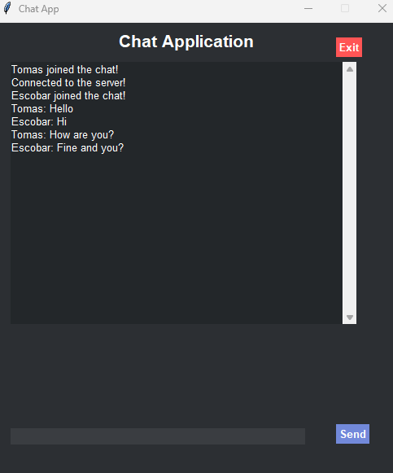

# Chat Application with Python (Client-Server)

This is a simple chat application built with Python using the socket library for client-server communication. The project demonstrates how to implement a multi-client chat system with a graphical user interface (GUI) using Tkinter.

## Features
- Real-time messaging between multiple clients.
- User-friendly graphical interface.
- Message broadcast to all connected clients.
- Notifications when users join or leave the chat.
- Sending messages using the Enter key or a "Send" button.

## Technologies Used
- Python (Socket Programming and Tkinter for the GUI)
- Threading for handling multiple clients.

## How It Works
1. **Server**:
   - The server accepts connections from clients and maintains a list of active clients.
   - Messages from one client are broadcast to all other connected clients.
2. **Client**:
   - The client connects to the server, provides a nickname, and participates in the chat.
   - The GUI allows users to send and receive messages in real-time.

### Steps
1. Clone this repository:
   ```bash
   git clone https://github.com/tscobarr/Simple-chat-app

2. Navigate to the project directory:
    cd chat-application

3. Start the server:
    python server.py

4. Start a client in a separate terminal or machine:
    python client.py

5. Enter a nickname when prompted and start chatting!

### Sending Messages
Type your message in the input field at the bottom of the client GUI.
Press the "Send" button or hit Enter to send the message.

### Stopping the Application
To disconnect a client, simply close the client window.
To stop the server, terminate the server terminal.

## Screenshoots


## Future Improvements
    - Add user authentication for secure access.
    - Implement encryption (e.g., Kyber) for secure message transmission.
    - Improve the GUI with more modern styling (e.g., using PyQt or custom themes).
    - Allow users to send files or images.